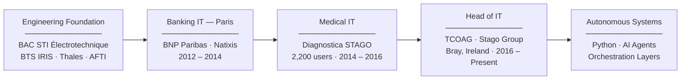

# Jean-Benoit Pilon

**Head of IT · Enterprise Infrastructure · Autonomous Systems**

Greystones, Co. Wicklow, Ireland &nbsp;·&nbsp; 

---

## Career Arc

---

## Public Projects

### IoT & Device Control
- **[Roborock S5 → Valetudo](https://github.com/Stoneface30/roborock-s5-valetudo)** — Complete UART root + dual A/B partition flash to Valetudo 2026.02.0. 22× faster flashing via optimized block writes, zero cloud dependency, MQTT Home Assistant integration, custom GLaDOS voice pack. Full technical journey with blockers documented.

### AI & Automation
- **[StonyClaw Showcase](https://github.com/Stoneface30/stonyclaw-showcase)** — Live 30-agent AI system building a pixel-art kingdom in real-time. Watch it evolve at [showcase.conchita.uk](https://showcase.conchita.uk/showcase)

- **[Quake Legacy](https://github.com/Stoneface30/quake-legacy)** — AI-powered fragmovie production system for Quake Live. Demo parsing, pattern recognition, automated rendering pipeline.

---

## Sovereign OS — Personal AI Stack

> Local AI orchestration: Claude Code + Ollama + Qdrant + n8n + multi-agent crews. Everything runs on-prem. No cloud dependency.

  

---

## Private Systems & Infrastructure

I also maintain a range of private systems for personal infrastructure, experimentation, and autonomous decision-making:

**AI & Autonomous Systems**
- **Sovereign OS** — Personal AI operating layer on Claude Code — sequential Ollama review chain (qwen→gemma), 3-layer memory (Qdrant · RuFlo · Obsidian Vault), 163 active learning rules, pipeline status visible on every edit
- **Polymarket Bot** — Autonomous multi-engine prediction market system with capital allocation, verification gates, and fail-safe execution
- **Binance Bot** — Algorithmic crypto trading with multi-strategy execution and risk management
- **Pantry AI** — Household decision engine combining structured inventory data, meal planning, recipe sourcing, and real-time price intelligence

**Hardware & Home Automation**
- **GARDEN_CLAUDED** — Plant monitoring system with automated irrigation and sensor telemetry (Raspberry Pi, MQTT)
- **ESP32_CLAUDED** — Embedded systems lab with 3 experimental boards and custom firmware
- **Magic Mirror** — Embedded information display integrating Home Assistant, MQTT, and AI-curated feeds (Raspberry Pi)
- **MEDIA_HUB_CLAUDED** — Plex setup with Real-Debrid + Zurg + Riven for unified media consumption
- **NEST_CAM_CLAUDED** — De-Google Nest Cam Doorbell (local fallback + privacy layer)
- **SAMSUNG_TV_CLAUDED** — Samsung Q80T developer access & PCM audio investigation
- **Home Assistant** — Large-scale home automation platform with entity orchestration, presence logic, energy-aware control

**Systems & Documentation**
- **Finance App** — Local-first financial analysis system for transaction normalisation and multi-account tracking
- **email-intelligence** — Intelligent email processing and insights system
- **Repo-Work** — Engineering documentation and procedures for industrial system recovery projects
- **portfolio** — Professional portfolio system

> Private systems are not accessible. Descriptions reflect current architecture and purpose. All systems emphasize local-first, zero-cloud-dependency design.

---

## How I Work

Every development session runs through **Sovereign OS** — a wiring harness on top of Claude Code:

- Sequential Ollama review chain per edit: qwen2.5-coder:7b (code patterns) then gemma4:e4b (reasoning), each loaded → reviewed → unloaded. Cross-process lock keeps multi-tab sessions VRAM-safe. Gemini 2.5 Pro and Codex run in parallel alongside.
- Every hook event emits a visible status line — no silent failures, no flying blind on which reviewers fired
- Prompt primer injects project context, active constraints, and stack info before every response
- Three-layer memory (Qdrant semantic search · RuFlo HNSW · Obsidian Vault) keeps context across sessions
- n8n automates file-change ingestion, session saves, and PR notifications via Telegram

The practical result: full project context at session start, no repeated mistakes, automated review on every change.

---

## Stack

**Infrastructure & Operations**

**Security & Networking**

**Python & Async Systems**

**Automation & AI**

**Embedded & Home Systems**

---

*14 years of enterprise IT across banking, medical diagnostics, and regulated environments.*
*Building autonomous systems at home, in Python, because the problems are worth solving.*
