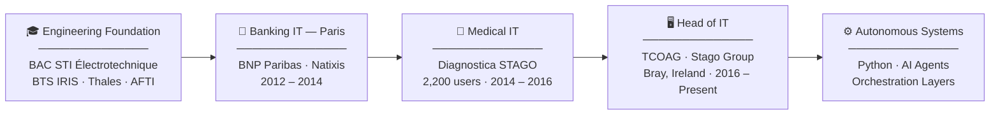
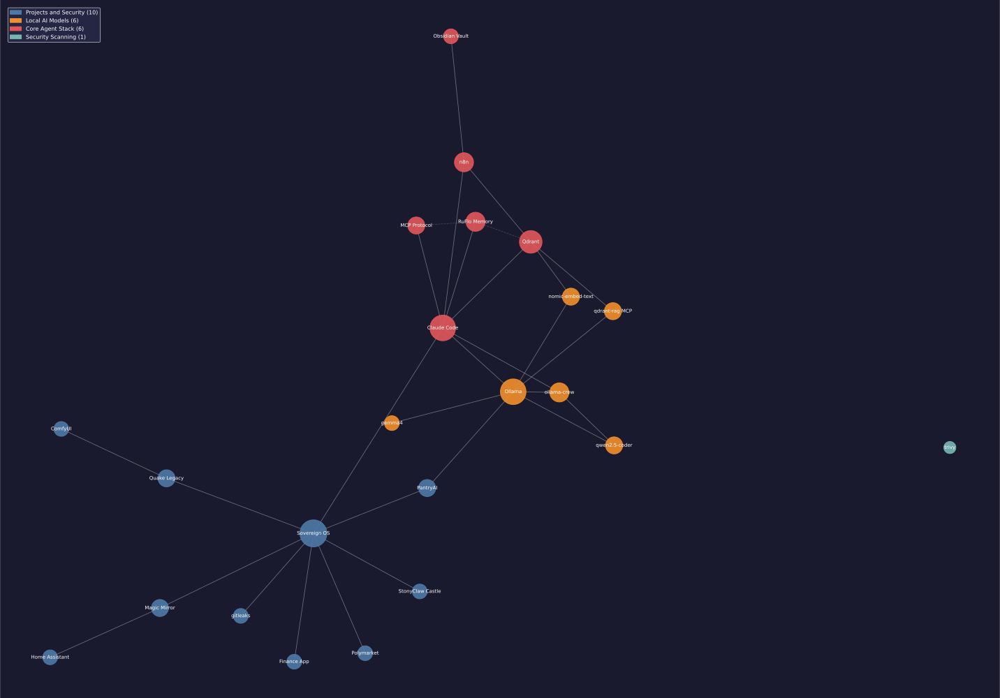

# Jean-Benoit Pilon

**Head of IT · Enterprise Infrastructure · Autonomous Systems**

Greystones, Co. Wicklow, Ireland &nbsp;·&nbsp; 

---

## Career Arc

---

## Sovereign OS — Stack

  

> Local AI orchestration: Claude Code + Ollama + Qdrant + n8n + multi-agent crews. Everything runs on-prem. No cloud dependency.

  

---

## Personal Technical Systems

| System | Description |
|---|---|
| **Polybot** | Autonomous multi-engine prediction system with capital allocation, verification gates, and fail-safe execution |
| **PantryAI** | Household decision engine combining structured inventory data, meal planning, and real-time price intelligence |
| **Sovereign OS** | Personal agent orchestration layer with persistent memory, self-learning, and multi-agent coordination |
| **StonyClaw Castle** | Real-time pixel-art interface over agent state, execution flow, and system logs |
| **Magic Mirror** | Embedded information display system integrating home automation data and AI-curated feeds via MQTT |
| **Home Assistant** | Large-scale home automation platform with entity orchestration, presence logic, and energy-aware control |
| **Finance App** | Local-first financial analysis system for transaction normalisation and multi-account tracking |
| [**StonyClaw Showcase**](https://github.com/Stoneface30/stonyclaw-showcase) | Public pre-alpha release — open access build of the StonyClaw Castle interface |

> Systems are private unless linked. Descriptions reflect architecture and purpose only.

---

## Stack

**Infrastructure & Operations**

**Security & Networking**

**Python & Async Systems**

**Automation & AI**

**Embedded & Home Systems**

---

*14 years of enterprise IT across banking, medical diagnostics, and regulated environments.*
*Building autonomous systems at home, in Python, because the problems are worth solving.*
